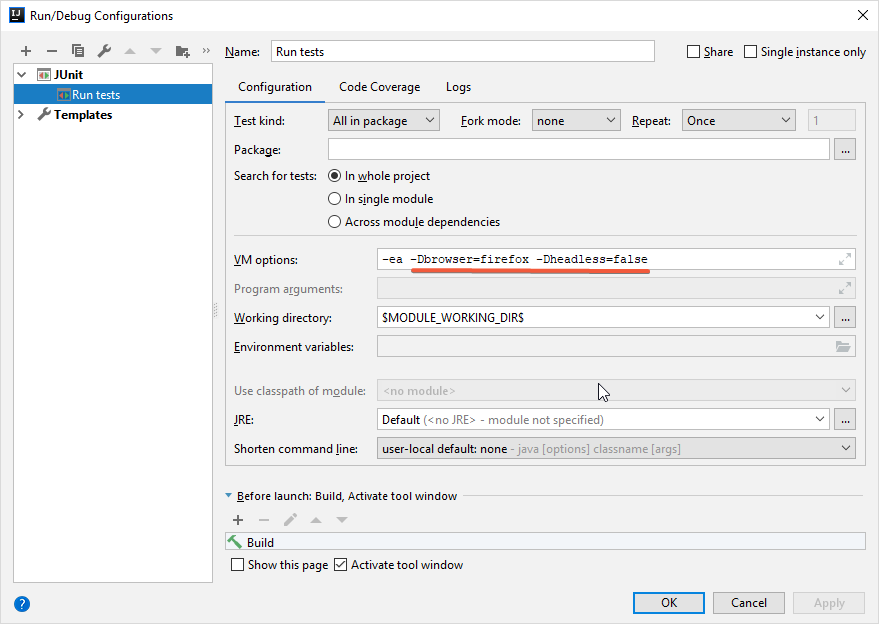

# Selenium Starter Kit
This aim of this project is to simplify the initial phase of the development of the automated end-to-end tests created using Selenium WebDriver.

Before you can start using Selenium, you have to get the driver for your browser and 
* set the path to that binary `System.setProperty("webdriver.gecko.driver", "path")`
* know the property name, here `webdriver.gecko.driver`. 
* Example of manual setup can be found [here](https://www.softwaretestinghelp.com/geckodriver-selenium-tutorial/).

The good 
* Everything is straightforward, and you know where everything is.

The bad
* It is annoying.
* You are hardcoding path to the location of the driver in the source code;
  * Imagine you are on Windows and you share the code with somebody who is using Linux or macOS.
  * Or the system running the code is using a completely different folder structure (for example in the CI pipeline).
* You must check whether a new driver was released.
* You must download a different version of the driver when you upgrade your browser, and the driver is no longer compatible with your browser.
* You will not be able to run tests in various browsers without refactoring.

This project is hiding this away by employing the power of [WebDriverManager](https://github.com/bonigarcia/webdrivermanager) project. The WDM project automatically detects the type and version of the browser you have installed on your system and download the appropriate driver automatically. See WDM project [examples](https://github.com/bonigarcia/webdrivermanager-examples) for more details. 

 All the necessary setup is reduced to 

```
WebDriverManager.firefoxdriver().setup();

FirefoxOptions options = new FirefoxOptions();
options.merge(capabilities);
options.setHeadless(HEADLESS);

return new FirefoxDriver(options);
```

### Execution
Tests can be run inside the IDE or from the command line using `mvn clean test`.

### Configuration
The project is using the WDM and the code I discovered recently with a little bit of configuration. Then the tests can be executed in different browsers.

The execution can be configured with system properties. 

```
mvn test -Dbrowser=firefox -Dheadless=true
```

Or with a property file `.properties` located in the current context directory - for maven test execution the directory is `/mastering-selenium-testng/target/test-classes`. See execution log for details.


When system properties are used, they **override** the values from the properties file. 

When property value is not provided the default value is used:
```
browser=chrome
headless=true
remote=false
seleniumGridURL=
platform=
browserVersion=
```

The configuration can change
* `browser` type (`chrome|firefox|edge|ie|safari|opera`) 
* `headless` mode (`true|false`)
* `remote` execution 

Or create run configuration for JUnit and set the "VM options":
 

### Libraries used
 * [WebDriverManager](https://github.com/bonigarcia/webdrivermanager)
 * [JUnit 5](https://junit.org/junit5/) for test authoring and execution
 * [AssertJ](https://joel-costigliola.github.io/assertj/) for smarter assertions

### Notes
Execution with Opera browser was not tested.

When running tests in Safari, you may get the following error
```
[ERROR] com.masteringselenium.tests.TodoMvcTests  Time elapsed: 0.994 s  <<< ERROR!
org.openqa.selenium.SessionNotCreatedException:
Could not create a session: You must enable the 'Allow Remote Automation' option in Safari's Develop menu to control Safari via WebDriver.
Build info: version: '3.141.59', revision: 'e82be7d358', time: '2018-11-14T08:17:03'
System info: host: '...', ip: '...', os.name: 'Mac OS X', os.arch: 'x86_64', os.version: '10.14.6', java.version: '10.0.1'
Driver info: driver.version: SafariDriver
```
The solution as mentioned in the error is to enable `Allow Remote Automation`  option in Safari's Develop menu, for more details see [Testing with WebDriver in Safari](https://developer.apple.com/documentation/webkit/testing_with_webdriver_in_safari) page.
